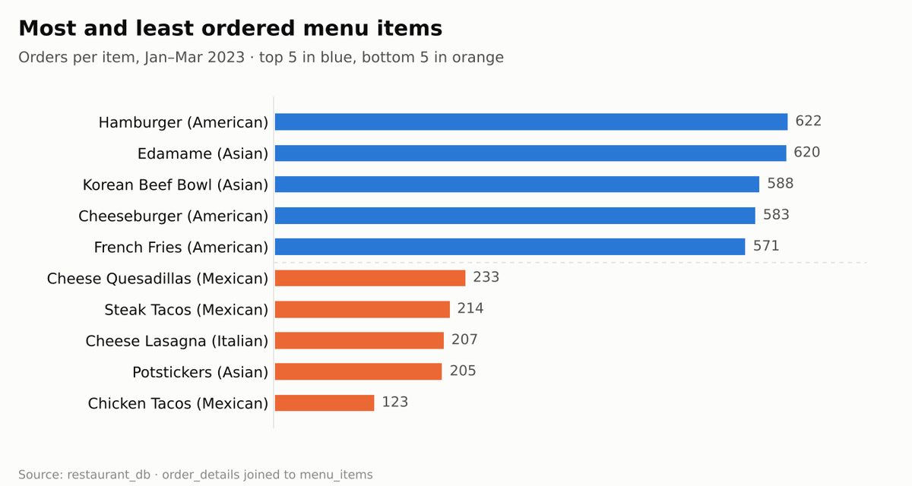
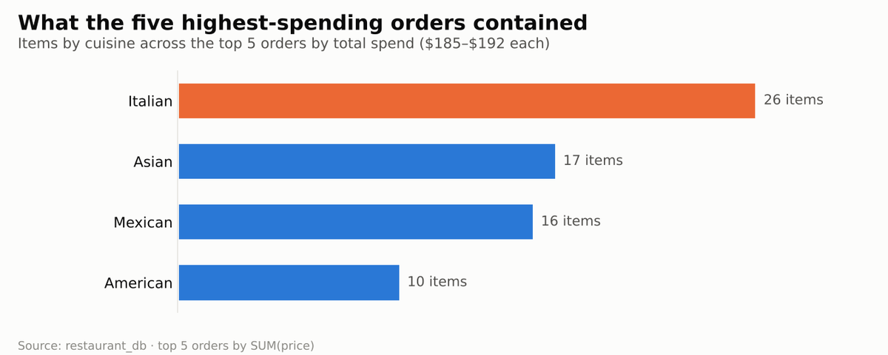

# 🍽️ Restaurant Order Analysis (SQL)

A SQL analysis of three months of orders from a restaurant that serves American, Asian, Italian and Mexican dishes. The goal: understand how the new menu is performing and what the highest-spending customers order.


## 🌐 Live Report

**[scarface96.github.io/Restaurant-Order-Analysis](https://scarface96.github.io/Restaurant-Order-Analysis/)**

Python now loads `create_restaurant_db.sql` into **DuckDB**, runs the project's SQL questions and publishes each query beside its real result, plus new analysis. GitHub Actions rebuilds the page on every push.

**What's new:**

- **The SQL questions, answered live:** queries from `res.sql` and `restaurant analysis.sql` with their results
- **Menu engineering** (Kasavana–Smith): every dish classed as a Star, Plowhorse, Puzzle or Dog. Six "Dogs" (cheap and rarely ordered) are the first candidates to drop: Chicken Tacos, Potstickers, Cheese Quesadillas, Chips & Guacamole, Veggie Burger, Hot Dog
- **Busy-hour heatmap:** lunch and dinner rushes, with Tuesday and Wednesday lunches running at about half the usual pace
- **Cuisine revenue:** Italian earns the most despite selling fewer items than Asian
- **Basket analysis** (support, confidence, lift): pairings are weak (the best is 1.55× chance), so cross-selling is a modest lever. A "what goes with each dish" explorer shows each dish's strongest partners
- **Data check:** 137 ordered items have no menu item recorded

## 📋 Overview

The analysis is split into three stages:

1. **Explore the menu** — how many items, what they cost, how they break down by cuisine
2. **Explore the orders** — date range, number of orders, items per order
3. **Analyse customer behaviour** — combine both tables to find the best- and worst-selling items and what the top orders contain

## 📈 Results at a Glance

Charts built with Python from `restaurant_db`, using the same joins as the SQL queries.

<p align="center"></p>

<p align="center"></p>

## 🗂️ Database

`restaurant_db` with two tables:

| Table | Fields |
|-------|--------|
| `menu_items` | `menu_item_id`, `item_name`, `category`, `price` |
| `order_details` | `order_details_id`, `order_id`, `order_date`, `order_time`, `item_id` |

**Size:** 32 menu items · 5,370 orders · 12,234 ordered items · 1 Jan – 31 Mar 2023

## 🔍 Example Queries

```sql
-- Most and least ordered items
SELECT item_name, category, COUNT(order_details_id) AS num_purchases
FROM order_details od
LEFT JOIN menu_items mi ON od.item_id = mi.menu_item_id
GROUP BY item_name, category
ORDER BY num_purchases;

-- Top 5 orders by total spend
SELECT order_id, SUM(price) AS total_spend
FROM order_details od
LEFT JOIN menu_items mi ON od.item_id = mi.menu_item_id
GROUP BY order_id
ORDER BY total_spend DESC
LIMIT 5;
```

## 📊 Key Findings

- **Menu:** 32 items across 4 cuisines, priced $5.00 – $19.95. Italian is the most expensive category on average (~$16.75).
- **Best sellers:** Hamburger (622 orders) and Edamame (620).
- **Worst sellers:** Chicken Tacos (123) and Potstickers (205).
- **Top 5 orders** each spent $185–$192 and contained 13–14 items.
- **High spenders favour Italian food** — Italian dishes make up the largest share of items in the top 5 orders, so Italian items should stay on the menu despite their higher price.

## 📁 Repository Contents

```
├── analysis/
│   ├── data.py        # Loads the dump into DuckDB; project queries; menu engineering; pairs; busy hours
│   ├── report.py      # Turns the analysis into the interactive web page
│   └── build.py       # Charts, the pairing explorer, site/index.html
├── tests/             # pytest checks
├── .github/workflows/deploy.yml   # Test, build and publish to GitHub Pages
├── create_restaurant_db.sql          # Creates the database and loads all data
├── res.sql                           # Stage 1: menu exploration
├── restaurant analysis.sql           # Stages 2–3: orders and customer behaviour
├── restaurant_db_data_dictionary.csv # Field definitions
└── requirements.txt
```

## 🚀 How to Run

**Python + DuckDB (no database server needed):**

```bash
pip install -r requirements.txt
python -m pytest
python -m analysis.build    # writes site/index.html
```

**MySQL:**

1. Open **MySQL Workbench** (or any MySQL client).
2. Run `create_restaurant_db.sql` to build and populate `restaurant_db`.
3. Run `res.sql`, then `restaurant analysis.sql`.

## 🛠️ Skills Demonstrated

`SELECT` / `WHERE` / `ORDER BY` · aggregate functions · `GROUP BY` · `JOIN`s · subqueries with `IN` · turning query results into business recommendations

---

👤 **Tony Mulunda** — [GitHub @Scarface96](https://github.com/Scarface96)

## About This Project

A SQL analytics project that turns restaurant transaction data into insights about menu performance, customer ordering behaviour and high-value orders. It demonstrates joins, aggregations, exploratory SQL and translating query results into practical business recommendations.
